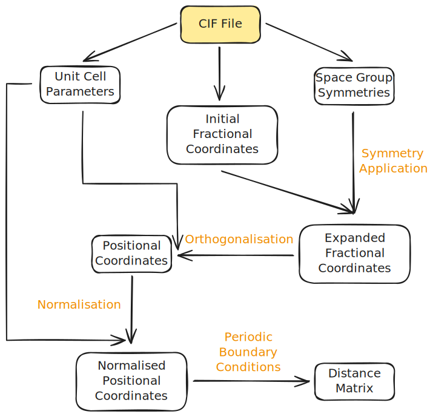

# Topological Data Analysis in Crystallography

This repository contains the code and resources for a BSc thesis titled "Topological Data Analysis in Crystallography." The project explores the application of topological data analysis techniques to the study of crystallographic structures.

For the report, see `docs` directory.

# About The Project

## Data Sources

[Database of Zeolite Structures](https://www.iza-structure.org/IZA-SC/ftc_table.php)